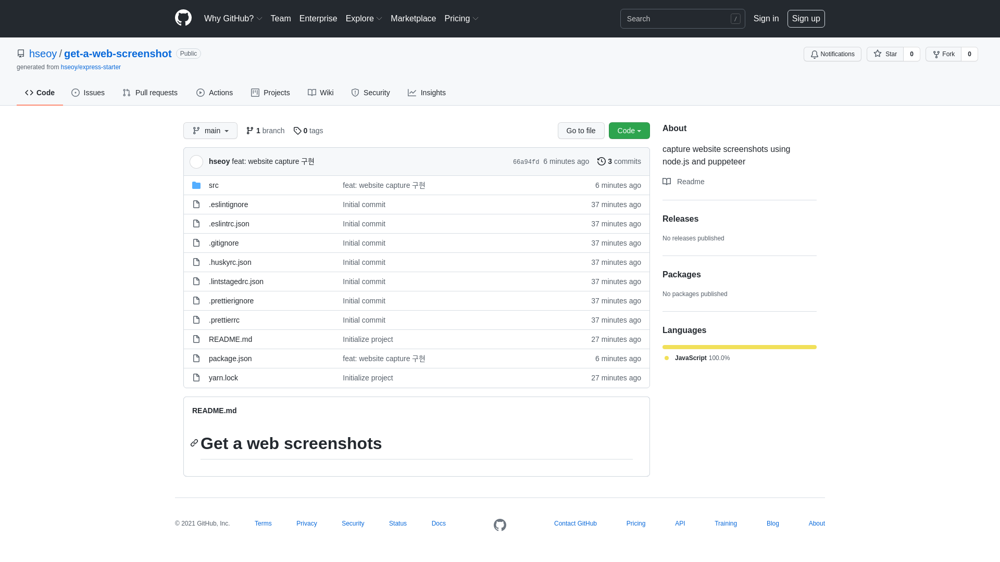

# Get a web screenshots

This is an express server to capture website screenshots using node.js and puppeteer.

## Install and Run

```bash
$ git clone https://github.com/hseoy/get-a-web-screenshot
$ yarn install
$ yarn start
```

## Usage

#### `GET /` API to capture website screenshot

Queries :
|query|description|is required|
|:---:|---|:---:|
|`website`|website url to capture|`yes`|

Returns: Captured website screenshot. `image/png`

Example:

- url: `http://localhost:3000/?website=https://github.com/hseoy/get-a-web-screenshot`
- response:


